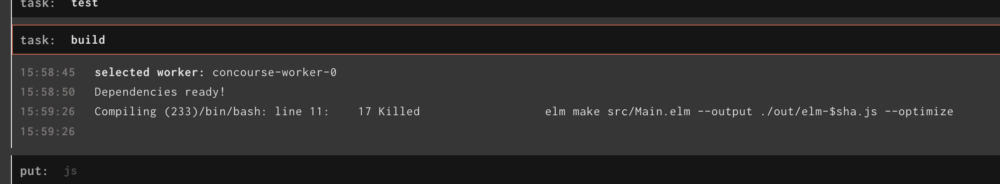
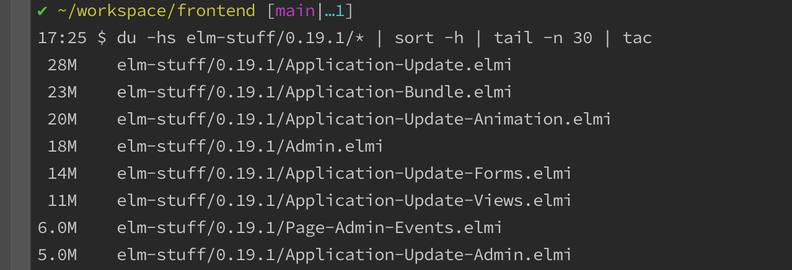

[Opaque types](https://sporto.github.io/elm-patterns/advanced/opaque-types.html) as an Elm design pattern always made sense - for libraries. The idea being that I use a **union type** for a plain old Elm object, instead of an **alias type**, even when there's only one **variant**.

So from:

```
type alias Model = { … }
```

to

```
type Model = Model { … }
```

I would do this to be able to **expose** the `type Model`, but not the `Model {...}`.<br/>
That way I (*the library author*) can change `Model {...}` without you (*the one using my library*) having to change all your code.

"Well... my Elm project isn't a library, so I don't need this 🤷", I thought to myself.

## But I was wrong...

The issues started when my CI system consistently failed to build my Elm project.



A little sleuthing led me to find that my CI system was actually killing the `elm make` process because it was consuming too much memory. I was incredulous at first but here's the make process again in a local docker image, with a 4GB memory limit.


The make process spikes the memory all the way to the cap at 4GB, and is subsequently killed.

Running the following command, led me to believe that it was my liberal usage of `type alias` contributing to excessive amounts of garbage collection during the `elm make` process.

```
# inside source code folder
du -hs elm-stuff/0.19.1/* | sort -h | tail -n 30
```



The helpful folks at [Elm Slack](https://elm-lang.org/community) taught me that `.elmi` files `>10MB` are considered _extremely_ large. Even `>1MB` was pushing it.

## The neat thing...

As soon as I converted my 3 most prominent **alias types** to the **opaque types** mentioned earlier, all the issues went away: the build failures, the memory spikes, and the slow compilation speeds.

I'd assume that the compiler has to perform double duty (*checking all the fields*) every time that an **alias type** must be passed into a method invocation. This being because any object would qualify as the **alias type** so long as all the fields match. There doesn't seem to be any official best practice about this in their docs...

But the neat thing is that these **union types** with one **variant** get treated as first-class citizens in Elm. So long as there's only one variant, "unwrapping" the object through the method signature passes compilation.

```
view : Model -> Html Msg
view (Model model) =
    -- ...
```

Just one way, among many, that Elm makes my life easier.